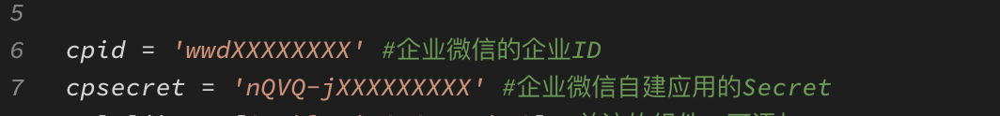
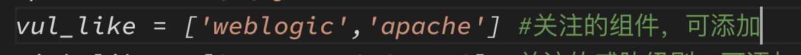
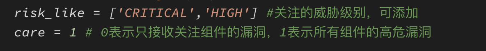
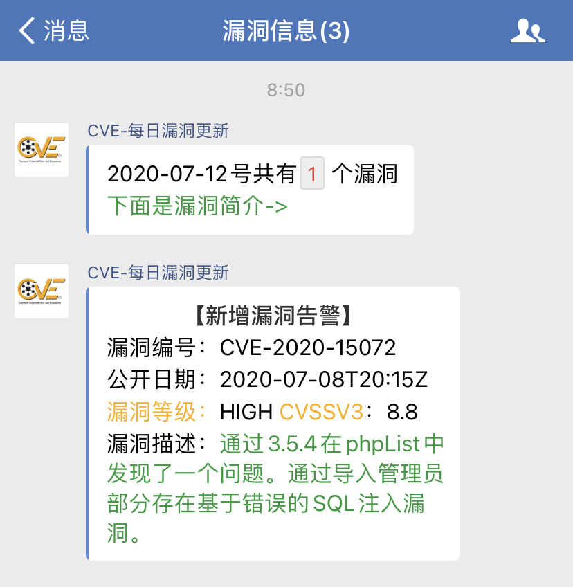

## DAY_CVEinfo
------

该脚本用于获取最新的CVE漏洞信息，通过企业微信的接口每日推送

### 实现方法：
------

```
1、使用NVD的公开api获取漏洞信息
2、对结果进行处理，过滤出自己感兴趣的漏洞
3、调用企业微信的api进行消息推送
4、放置在服务器上定时运行
```

### 如何使用

---

1、下载项目文件

`git clone https://github.com/knight-TBO/DAY_CVEinfo.git`

2、`cd DAY_CVEinfo` 目录

3、安装需求库

`pip install -r requirements.txt`

4、填写企业微信信息



5、在服务器建立定时任务，例如每天早上8:50推送

`crontab -e`
``50 08 * * * /usr/bin/python3 NEW_CVEinfo.py``

### 其它玩法：

---

1、只推送自己感兴趣的组件漏洞，通过更改``vul_like`参数



2、只推送自己感兴趣的漏洞级别，通过更改`risk_like`和`care`参数



### 运行效果：

---




